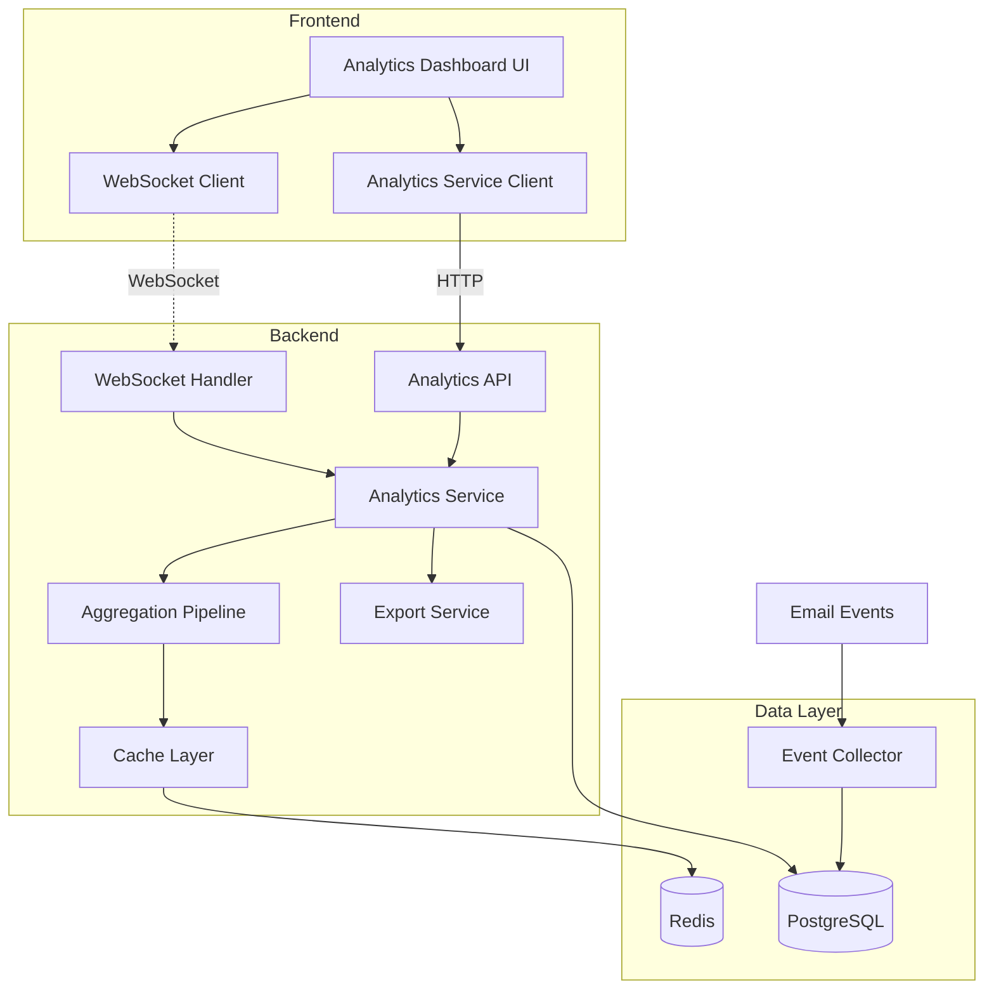
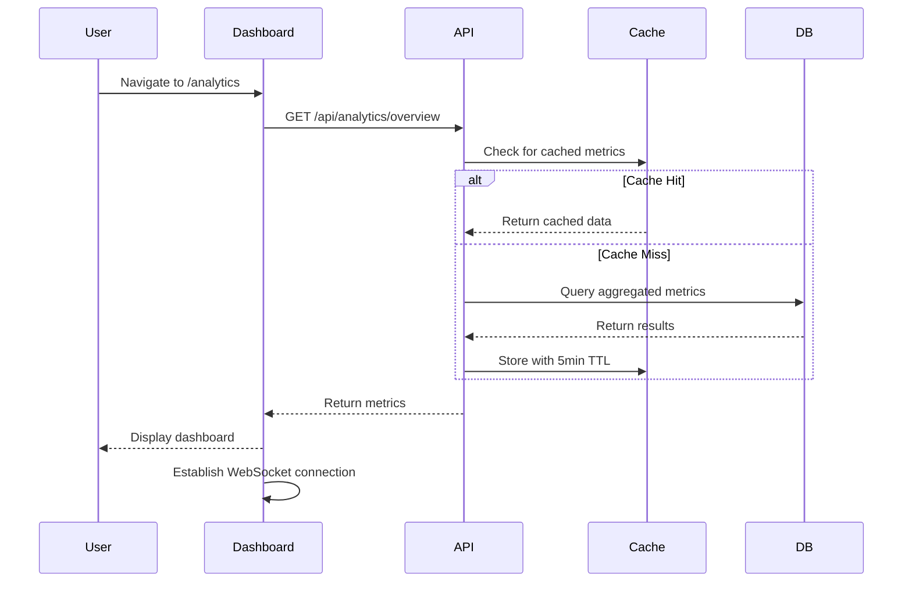
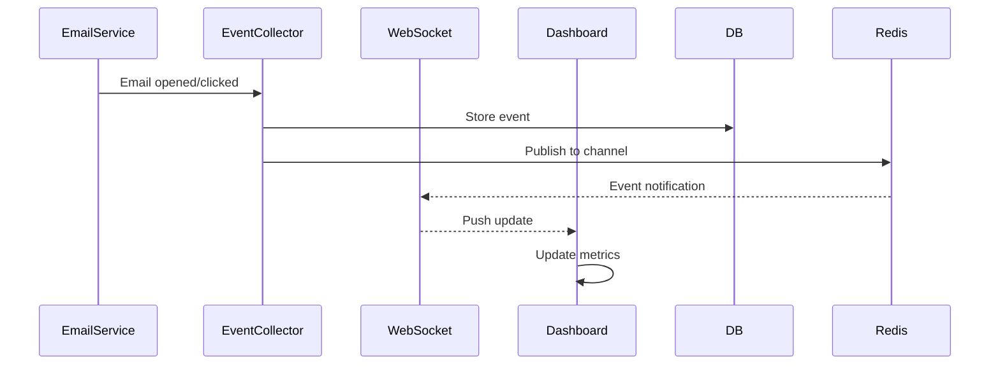
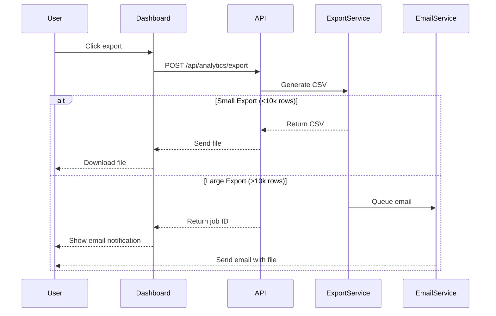
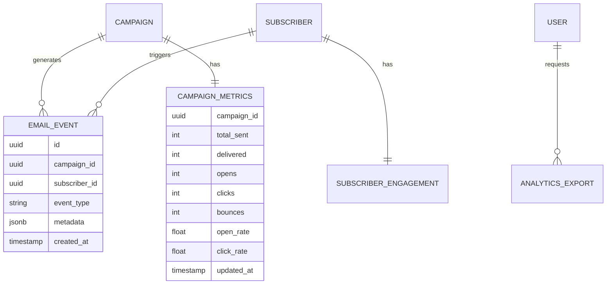
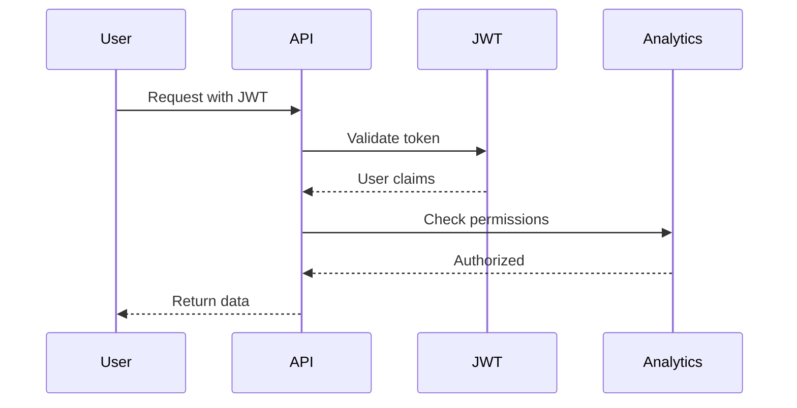
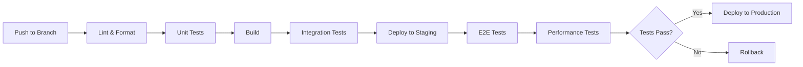

# Technical Design: Email Analytics Dashboard

## Overview

The Email Analytics Dashboard will be implemented as a new module within the
existing MarkMail architecture, leveraging the current Rust/Axum backend and
SvelteKit frontend. The design focuses on real-time metrics collection,
efficient data aggregation, and responsive visualization while maintaining the
existing system's performance and security standards.

## Requirements Mapping

### Design Component Traceability

Each design component directly addresses specific requirements from
requirements.md:

- **Analytics Service (Backend)** → REQ-1: Dashboard Overview, REQ-2: Campaign
  Metrics, REQ-7: Performance
- **WebSocket Handler** → REQ-6: Real-Time Updates (10-second updates, 5-second
  engagement events)
- **Data Aggregation Pipeline** → REQ-3: Time-Series Visualization, REQ-7:
  Scalability (pre-calculated summaries)
- **Export Service** → REQ-5: Export and Reporting (CSV generation, email
  delivery for large exports)
- **Engagement Tracker** → REQ-4: Subscriber Engagement Analysis, REQ-8: Data
  Integrity
- **Dashboard UI Components** → REQ-1: Navigation, REQ-3: Visualization (charts,
  tables)
- **Caching Layer** → REQ-7: Performance (3-second load time, 5-minute cache
  refresh)

### User Story Coverage

- **Marketing Manager Story** → Dashboard overview component with summary
  widgets
- **Campaign Manager Story** → Campaign table with expandable rows, real-time
  updates
- **Data Analyst Story** → Time-series charts with Chart.js, comparison views
- **Marketing Strategist Story** → Engagement distribution charts, segmentation
  metrics
- **Business Owner Story** → Export service with CSV generation and email
  delivery
- **Campaign Operator Story** → WebSocket real-time updates, connection
  indicators
- **High-Volume Sender Story** → Pre-aggregated data, async processing
- **Compliance Officer Story** → Data anonymization, audit logging

## Architecture



### Technology Stack

Based on existing MarkMail infrastructure and requirements:

- **Frontend**: SvelteKit 2.x + TypeScript + TailwindCSS
  - **Charting**: Chart.js 4.x for time-series visualization
  - **WebSocket**: Native WebSocket API with reconnection logic
  - **Export**: FileSaver.js for client-side CSV downloads
- **Backend**: Rust + Axum 0.7
  - **WebSocket**: tokio-tungstenite for real-time updates
  - **Data Processing**: rayon for parallel aggregation
  - **CSV Generation**: csv crate for export functionality
- **Database**: PostgreSQL 16.x with SQLx
  - **Time-series Data**: TimescaleDB extension for efficient analytics
- **Cache**: Redis 7.x for aggregated metrics
- **Message Queue**: Redis Pub/Sub for real-time event distribution

### Architecture Decision Rationale

- **Chart.js over D3.js**: Simpler API for standard charts, better performance
  for real-time updates
- **TimescaleDB Extension**: Optimized for time-series data, automatic data
  partitioning, efficient aggregations
- **Redis for Caching**: Already in stack, supports pub/sub for real-time events
- **WebSocket over SSE**: Bi-directional communication for dashboard
  interactions
- **Rust Async Processing**: Leverages existing Tokio runtime, excellent
  performance for aggregations

## Data Flow

### Primary User Flows

#### 1. Dashboard Load Flow



#### 2. Real-Time Update Flow



#### 3. Export Flow



## Components and Interfaces

### Backend Services & Method Signatures

#### AnalyticsService (Rust)

```rust
pub struct AnalyticsService {
    db: Arc<PgPool>,
    cache: Arc<RedisClient>,
}

impl AnalyticsService {
    pub async fn get_overview(&self, user_id: Uuid, range: DateRange) -> Result<Overview>;
    pub async fn get_campaign_metrics(&self, campaign_id: Uuid) -> Result<CampaignMetrics>;
    pub async fn get_time_series(&self, params: TimeSeriesParams) -> Result<Vec<DataPoint>>;
    pub async fn get_engagement_distribution(&self, user_id: Uuid) -> Result<EngagementDist>;
    pub async fn aggregate_metrics(&self, since: DateTime<Utc>) -> Result<()>;
    pub async fn calculate_open_rate(&self, campaign_id: Uuid) -> Result<f64>;
    pub async fn calculate_click_rate(&self, campaign_id: Uuid) -> Result<f64>;
}
```

#### ExportService (Rust)

```rust
pub struct ExportService {
    analytics: Arc<AnalyticsService>,
    email: Arc<EmailService>,
}

impl ExportService {
    pub async fn export_to_csv(&self, params: ExportParams) -> Result<ExportResult>;
    pub async fn queue_large_export(&self, params: ExportParams) -> Result<JobId>;
    pub async fn process_export_job(&self, job_id: JobId) -> Result<()>;
}
```

#### WebSocketHandler (Rust)

```rust
pub struct WebSocketHandler {
    connections: Arc<RwLock<HashMap<Uuid, Sender<Message>>>>,
    redis: Arc<RedisClient>,
}

impl WebSocketHandler {
    pub async fn handle_connection(&self, ws: WebSocket, user_id: Uuid) -> Result<()>;
    pub async fn broadcast_update(&self, update: MetricUpdate) -> Result<()>;
    pub async fn handle_subscription(&self, channel: String) -> Result<()>;
}
```

### Frontend Components

| Component            | Responsibility              | Props/State Summary                         |
| -------------------- | --------------------------- | ------------------------------------------- |
| `AnalyticsDashboard` | Main dashboard container    | `timeRange`, `campaigns`, `metrics`         |
| `MetricsSummary`     | Display overview cards      | `totalSent`, `avgOpenRate`, `avgClickRate`  |
| `CampaignTable`      | Sortable campaign list      | `campaigns[]`, `sortColumn`, `expandedRows` |
| `TimeSeriesChart`    | Line chart visualization    | `data[]`, `series[]`, `timeRange`           |
| `EngagementChart`    | Donut chart for engagement  | `distribution`, `total`                     |
| `ExportButton`       | Handle export functionality | `filters`, `onExport`                       |
| `RealTimeIndicator`  | WebSocket connection status | `connected`, `lastUpdate`                   |
| `DateRangePicker`    | Time range selection        | `selected`, `onChange`                      |

### API Endpoints

| Method | Route                          | Purpose                         | Auth     | Status Codes            |
| ------ | ------------------------------ | ------------------------------- | -------- | ----------------------- |
| GET    | `/api/analytics/overview`      | Get dashboard summary           | Required | 200, 401, 500           |
| GET    | `/api/analytics/campaigns`     | List campaign metrics           | Required | 200, 401, 500           |
| GET    | `/api/analytics/campaigns/:id` | Get detailed campaign metrics   | Required | 200, 401, 404, 500      |
| GET    | `/api/analytics/time-series`   | Get time-series data            | Required | 200, 400, 401, 500      |
| GET    | `/api/analytics/engagement`    | Get engagement distribution     | Required | 200, 401, 500           |
| POST   | `/api/analytics/export`        | Export analytics data           | Required | 200, 202, 400, 401, 500 |
| GET    | `/api/analytics/export/:jobId` | Check export job status         | Required | 200, 401, 404, 500      |
| WS     | `/ws/analytics`                | WebSocket for real-time updates | Required | 101, 401, 500           |

## Data Models

### Domain Entities

1. **EmailEvent**: Core event tracking for opens, clicks, bounces
2. **CampaignMetrics**: Aggregated metrics per campaign
3. **SubscriberEngagement**: Engagement scoring per subscriber
4. **AnalyticsExport**: Export job tracking

### Entity Relationships



### Data Model Definitions

#### TypeScript Interfaces

```typescript
interface EmailEvent {
  id: string;
  campaignId: string;
  subscriberId: string;
  eventType:
    | 'sent'
    | 'delivered'
    | 'opened'
    | 'clicked'
    | 'bounced'
    | 'unsubscribed';
  metadata: Record<string, any>;
  createdAt: Date;
}

interface CampaignMetrics {
  campaignId: string;
  campaignName: string;
  sendDate: Date;
  totalSent: number;
  delivered: number;
  uniqueOpens: number;
  uniqueClicks: number;
  bounces: number;
  unsubscribes: number;
  openRate: number;
  clickRate: number;
  deliveryRate: number;
  updatedAt: Date;
}

interface TimeSeriesDataPoint {
  timestamp: Date;
  opens: number;
  clicks: number;
  cumulative: boolean;
}

interface EngagementDistribution {
  highlyEngaged: number; // >75% open rate
  engaged: number; // 50-75%
  moderate: number; // 25-50%
  low: number; // <25%
  inactive: number; // No opens in 90 days
}
```

#### Rust Structs

```rust
#[derive(Serialize, Deserialize, sqlx::FromRow)]
pub struct EmailEvent {
    pub id: Uuid,
    pub campaign_id: Uuid,
    pub subscriber_id: Uuid,
    pub event_type: EventType,
    pub metadata: serde_json::Value,
    pub created_at: DateTime<Utc>,
}

#[derive(Serialize, Deserialize)]
pub struct CampaignMetrics {
    pub campaign_id: Uuid,
    pub campaign_name: String,
    pub send_date: DateTime<Utc>,
    pub total_sent: i32,
    pub delivered: i32,
    pub unique_opens: i32,
    pub unique_clicks: i32,
    pub bounces: i32,
    pub unsubscribes: i32,
    pub open_rate: f64,
    pub click_rate: f64,
    pub delivery_rate: f64,
    pub updated_at: DateTime<Utc>,
}
```

### Database Schema

```sql
-- Email events table (partitioned by month using TimescaleDB)
CREATE TABLE email_events (
    id UUID PRIMARY KEY DEFAULT gen_random_uuid(),
    campaign_id UUID NOT NULL REFERENCES campaigns(id),
    subscriber_id UUID NOT NULL REFERENCES subscribers(id),
    event_type VARCHAR(20) NOT NULL,
    metadata JSONB,
    created_at TIMESTAMPTZ NOT NULL DEFAULT NOW()
);

-- Convert to hypertable for time-series optimization
SELECT create_hypertable('email_events', 'created_at');

-- Indexes for performance
CREATE INDEX idx_email_events_campaign_created ON email_events(campaign_id, created_at DESC);
CREATE INDEX idx_email_events_subscriber_created ON email_events(subscriber_id, created_at DESC);
CREATE INDEX idx_email_events_type_created ON email_events(event_type, created_at DESC);

-- Campaign metrics table (materialized view refreshed every 5 minutes)
CREATE MATERIALIZED VIEW campaign_metrics AS
SELECT
    c.id AS campaign_id,
    c.name AS campaign_name,
    c.sent_at AS send_date,
    COUNT(DISTINCT CASE WHEN e.event_type = 'sent' THEN e.subscriber_id END) AS total_sent,
    COUNT(DISTINCT CASE WHEN e.event_type = 'delivered' THEN e.subscriber_id END) AS delivered,
    COUNT(DISTINCT CASE WHEN e.event_type = 'opened' THEN e.subscriber_id END) AS unique_opens,
    COUNT(DISTINCT CASE WHEN e.event_type = 'clicked' THEN e.subscriber_id END) AS unique_clicks,
    COUNT(DISTINCT CASE WHEN e.event_type = 'bounced' THEN e.subscriber_id END) AS bounces,
    COUNT(DISTINCT CASE WHEN e.event_type = 'unsubscribed' THEN e.subscriber_id END) AS unsubscribes,
    NOW() AS updated_at
FROM campaigns c
LEFT JOIN email_events e ON c.id = e.campaign_id
GROUP BY c.id, c.name, c.sent_at;

CREATE UNIQUE INDEX ON campaign_metrics(campaign_id);

-- Subscriber engagement scores
CREATE TABLE subscriber_engagement (
    subscriber_id UUID PRIMARY KEY REFERENCES subscribers(id),
    total_sent INTEGER DEFAULT 0,
    total_opens INTEGER DEFAULT 0,
    total_clicks INTEGER DEFAULT 0,
    last_open_at TIMESTAMPTZ,
    last_click_at TIMESTAMPTZ,
    engagement_score FLOAT,
    engagement_tier VARCHAR(20),
    updated_at TIMESTAMPTZ DEFAULT NOW()
);

-- Analytics export jobs
CREATE TABLE analytics_exports (
    id UUID PRIMARY KEY DEFAULT gen_random_uuid(),
    user_id UUID NOT NULL REFERENCES users(id),
    status VARCHAR(20) NOT NULL DEFAULT 'pending',
    params JSONB NOT NULL,
    file_url TEXT,
    error_message TEXT,
    created_at TIMESTAMPTZ DEFAULT NOW(),
    completed_at TIMESTAMPTZ
);
```

### Migration Strategy

1. **Initial Migration**: Create tables, indexes, and hypertable
2. **Data Backfill**: Process existing campaign data to populate events
3. **Continuous Sync**: Update events table on email send/engagement
4. **Materialized View Refresh**: Cron job every 5 minutes
5. **Data Retention**: Automatic cleanup of events older than 90 days
   (configurable by tier)

## Error Handling

### Error Categories

```rust
#[derive(Debug, thiserror::Error)]
pub enum AnalyticsError {
    #[error("Database error: {0}")]
    Database(#[from] sqlx::Error),

    #[error("Cache error: {0}")]
    Cache(#[from] redis::RedisError),

    #[error("Export too large: {0} rows")]
    ExportTooLarge(usize),

    #[error("Invalid time range")]
    InvalidTimeRange,

    #[error("Insufficient permissions")]
    Unauthorized,

    #[error("Rate limit exceeded")]
    RateLimited,
}
```

### Error Handling Strategy

- **Graceful Degradation**: Fall back to database if cache fails
- **Retry Logic**: Exponential backoff for transient failures
- **User Feedback**: Clear error messages in UI
- **Monitoring**: Log all errors to CloudWatch

## Security Considerations

### Authentication & Authorization



### Authorization Matrix

| Role          | View Own Analytics | View All Analytics | Export Data      | Real-time Updates |
| ------------- | ------------------ | ------------------ | ---------------- | ----------------- |
| Free User     | ✓ (limited)        | ✗                  | ✗                | ✗                 |
| Pro User      | ✓                  | ✗                  | ✓ (rate-limited) | ✓                 |
| Business User | ✓                  | ✓                  | ✓                | ✓                 |
| Admin         | ✓                  | ✓                  | ✓                | ✓                 |

### Data Protection

- **PII Anonymization**: Hash IP addresses, anonymize user agents
- **GDPR Compliance**: Right to deletion, data portability
- **Rate Limiting**: 100 requests/minute for analytics endpoints
- **Export Limits**: Max 100k rows per export, 10 exports/day

## Performance & Scalability

### Performance Targets

| Metric               | Target  | Measurement        | Implementation       |
| -------------------- | ------- | ------------------ | -------------------- |
| Dashboard Load (p95) | < 3s    | Full page load     | CDN, pre-aggregation |
| API Response (p95)   | < 200ms | Backend processing | Redis cache, indexes |
| API Response (p99)   | < 500ms | Backend processing | Query optimization   |
| WebSocket Latency    | < 5s    | Event to UI update | Redis pub/sub        |
| Chart Render         | < 1s    | Client-side        | Virtual scrolling    |
| Export Generation    | < 30s   | 100k rows          | Streaming CSV        |

### Caching Strategy

```yaml
Cache Layers:
  CDN:
    - Static assets (JS, CSS)
    - TTL: 1 year with cache busting

  Redis:
    - Dashboard overview: 5 minutes
    - Campaign metrics: 5 minutes
    - Time-series data: 10 minutes
    - User permissions: 15 minutes

  Browser:
    - API responses: 1 minute
    - WebSocket reconnection state
```

### Scalability Approach

1. **Horizontal Scaling**: Multiple API instances behind load balancer
2. **Database Optimization**:
   - Read replicas for analytics queries
   - TimescaleDB continuous aggregates
   - Partitioning by month
3. **Async Processing**: Background jobs for exports and aggregations
4. **WebSocket Scaling**: Redis pub/sub for multi-instance coordination

## Testing Strategy

### Test Coverage Requirements

- **Unit Tests**: ≥85% for analytics service
- **Integration Tests**: All API endpoints
- **E2E Tests**: Dashboard load, export, real-time updates
- **Performance Tests**: 10,000 concurrent users

### Testing Approach

#### Unit Testing (Rust)

```rust
#[cfg(test)]
mod tests {
    use super::*;

    #[tokio::test]
    async fn test_calculate_open_rate() {
        let service = AnalyticsService::new_mock();
        let rate = service.calculate_open_rate(campaign_id).await.unwrap();
        assert_eq!(rate, 0.25); // 25% open rate
    }
}
```

#### Integration Testing

```typescript
describe('Analytics API', () => {
  it('should return dashboard overview', async () => {
    const response = await api.get('/api/analytics/overview');
    expect(response.status).toBe(200);
    expect(response.data).toHaveProperty('totalSent');
  });
});
```

#### E2E Testing (Playwright)

```typescript
test('Dashboard loads and displays metrics', async ({ page }) => {
  await page.goto('/analytics');
  await expect(page.locator('[data-testid="total-sent"]')).toBeVisible();
  await expect(page.locator('[data-testid="open-rate"]')).toContainText('%');
});
```

#### Performance Testing (k6)

```javascript
export default function () {
  const response = http.get('https://api.markmail.dev/analytics/overview', {
    headers: { Authorization: `Bearer ${__ENV.TOKEN}` },
  });
  check(response, {
    'status is 200': r => r.status === 200,
    'response time < 500ms': r => r.timings.duration < 500,
  });
}
```

### CI/CD Pipeline



## Implementation Priorities

### Phase 1: Core Analytics (Week 1-2)

- Basic dashboard UI
- Campaign metrics collection
- Database schema and migrations
- REST API endpoints

### Phase 2: Real-time Updates (Week 3)

- WebSocket implementation
- Redis pub/sub setup
- Live metric updates
- Connection status indicators

### Phase 3: Advanced Features (Week 4)

- Time-series visualization
- Export functionality
- Engagement analysis
- Performance optimization

## Monitoring & Observability

### Metrics to Track

- Dashboard load times
- API response times
- WebSocket connection count
- Cache hit rates
- Export job success rates
- Database query performance

### Alerting Thresholds

- Dashboard load time > 5s
- API error rate > 1%
- WebSocket disconnection rate > 5%
- Export failure rate > 2%
- Database connection pool exhaustion
