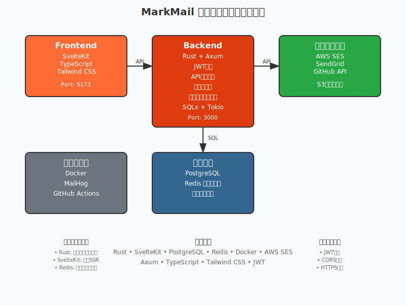

# MarkMail

エンジニア向けマークダウンベースメールマーケティングツール

## 🎯 プロジェクト概要

**MarkMail**は、エンジニアが慣れ親しんだマークダウン記法を使ってメールテンプレートを作成し、効率的なメールマーケティングを実現するツールです。

### 技術スタック

- **バックエンド**: Rust (Axum + SQLx + Tokio)
- **フロントエンド**: Svelte + SvelteKit + TypeScript
- **データベース**: PostgreSQL
- **キャッシュ**: Redis
- **メール送信**: AWS SES / SendGrid
- **認証**: JWT + OAuth2
- **自動整形**: lefthook + Prettier + rustfmt
- **デプロイ**: Docker + Railway/Fly.io

## 🏗️ システムアーキテクチャ

以下は MarkMail のシステム全体のアーキテクチャ図です：

<div align="center">
  
</div>

<details>
<summary>詳細なアーキテクチャ図</summary>


</details>

<details>
<summary>テキストベースのアーキテクチャ図</summary>

```
┌─────────────────────────────────────────────────────────────────────┐
│                    MarkMail システムアーキテクチャ                    │
└─────────────────────────────────────────────────────────────────────┘

┌───────────────┐    API Calls    ┌───────────────┐    API Calls    ┌───────────────┐
│   Frontend    │ ──────────────► │   Backend     │ ──────────────► │ External      │
│  (SvelteKit)  │                 │   (Rust)      │                 │ Services      │
│               │                 │               │                 │               │
│ • UI          │                 │ • Axum API    │                 │ • AWS SES     │
│ • MD Editor   │                 │ • JWT Auth    │                 │ • SendGrid    │
│ • Preview     │                 │ • Email Mgr   │                 │ • GitHub API  │
│ • TypeScript  │                 │ • Template    │                 │ • S3 Storage  │
│ • Tailwind    │                 │ • Campaign    │                 │               │
│               │                 │ • User Mgr    │                 │               │
│ Port: 5173    │                 │ Port: 3000    │                 │               │
└───────────────┘                 └───────┬───────┘                 └───────────────┘
                                          │
                                      SQL/Cache
                                          │
                                          ▼
                    ┌─────────────────────────────────────┐
                    │            Data Layer               │
                    │                                     │
                    │  ┌─────────────┐  ┌─────────────┐  │
                    │  │ PostgreSQL  │  │    Redis    │  │
                    │  │    (DB)     │  │  (Cache)    │  │
                    │  └─────────────┘  └─────────────┘  │
                    └─────────────────────────────────────┘

┌───────────────┐
│ Development   │
│ Tools         │
│               │
│ • Docker      │
│ • MailHog     │
│ • Railway     │
│ • GitHub      │
│   Actions     │
└───────────────┘
```

</details>

### アーキテクチャの特徴

- **マイクロサービス指向**: フロントエンド、バックエンド、データ層が分離された設計
- **高パフォーマンス**: Rust と SvelteKit による高速なレスポンス
- **スケーラブル**: Redis キャッシュと PostgreSQL による高いスケーラビリティ
- **セキュア**: JWT 認証と多層防御によるセキュリティ
- **開発体験**: Docker と自動整形による快適な開発環境

## 🚀 クイックスタート

### 前提条件

- Docker & Docker Compose
- Rust (1.75+)
- Node.js (18+)

### ローカル開発環境のセットアップ

1. **プロジェクトのクローン**

```bash
git clone https://github.com/your-org/markmail.git
cd markmail
```

2. **環境変数の設定**

```bash
cp env.example .env
# .env ファイルを編集して必要な値を設定
```

3. **自動整形のセットアップ（重要！）**

```bash
./scripts/setup-lefthook.sh
```

これで `git commit` 時に自動整形が実行されるようになります。

4. **Docker Compose で開発環境起動**

```bash
docker-compose up -d
```

5. **データベースマイグレーション**

```bash
cd backend
cargo install sqlx-cli
sqlx migrate run
```

### アクセス先

- **フロントエンド**: http://localhost:5173
- **バックエンド API**: http://localhost:3000
- **MailHog (メール確認)**: http://localhost:8025

## ✨ 自動整形機能

### 🪝 Git Hooks による自動整形

**lefthook**を使用して、コミット時に自動的にコードを整形します：

- **git commit 時**:
  - Rust コード → `cargo fmt` で整形
  - フロントエンドコード → `prettier` で整形
  - リンターチェック → `cargo clippy` & `eslint`
- **git push 時**:
  - テスト自動実行

### 🎨 手動整形コマンド

```bash
# 全体のフォーマット
npm run format

# バックエンドのみ（Rust）
npm run format:backend

# フロントエンドのみ（Svelte/TypeScript）
npm run format:frontend

# リンター
npm run lint
```

### 🔧 VS Code 自動整形

VS Code を使用している場合、以下が自動で設定されます：

- **保存時自動整形**: ファイル保存時に自動フォーマット
- **ペースト時自動整形**: コードペースト時に自動フォーマット
- **推奨拡張機能**: Rust Analyzer、Svelte、Prettier 等

## 📁 プロジェクト構造

```
markmail/
├── backend/                 # Rust バックエンド
│   ├── src/
│   │   ├── main.rs
│   │   ├── api/             # API ルート定義
│   │   ├── services/        # ビジネスロジック
│   │   ├── models/          # データモデル
│   │   ├── database/        # DB関連
│   │   ├── middleware/      # ミドルウェア
│   │   └── utils/           # ユーティリティ
│   ├── Cargo.toml
│   ├── rustfmt.toml         # Rust フォーマット設定
│   └── Dockerfile.dev
├── frontend/                # Svelte フロントエンド
│   ├── src/
│   │   ├── routes/          # SvelteKit ルート
│   │   └── lib/             # 共有コンポーネント
│   ├── package.json
│   ├── .eslintrc.cjs        # ESLint 設定
│   └── Dockerfile.dev
├── .vscode/                 # VS Code 設定
│   ├── settings.json        # エディタ設定
│   └── extensions.json      # 推奨拡張機能
├── lefthook.yml             # Git hooks 設定
├── .prettierrc              # Prettier 設定
├── docker-compose.yml       # ローカル開発環境
└── README.md
```

## 🔧 開発コマンド

### バックエンド (Rust)

```bash
cd backend

# 開発サーバー起動
cargo run

# テスト実行
cargo test

# リンター実行
cargo clippy

# フォーマット
cargo fmt
```

### フロントエンド (Svelte)

```bash
cd frontend

# 依存関係インストール
npm install

# 開発サーバー起動
npm run dev

# ビルド
npm run build

# 型チェック
npm run check

# テスト実行
npm run test

# フォーマット
npm run format

# リンター
npm run lint
```

## 🌟 主な機能

### ✅ 実装済み

- [x] プロジェクト構造の作成
- [x] Rust バックエンドの基本セットアップ
- [x] Svelte フロントエンドの基本セットアップ
- [x] Docker 開発環境
- [x] API エンドポイントの定義
- [x] データモデルの定義
- [x] **自動整形システム (lefthook)**
- [x] **VS Code 開発環境設定**
- [x] **認証システム (JWT)**
  - [x] ユーザー登録・ログイン
  - [x] JWT トークン発行・検証
  - [x] リフレッシュトークン
  - [x] 認証ミドルウェア
  - [x] プロフィール管理 API

### 🚧 開発中

- [ ] マークダウンエディター
- [ ] テンプレート管理
- [ ] メール送信機能
- [ ] キャンペーン管理
- [ ] 購読者管理

### 📋 今後の予定

- [ ] GitHub 連携
- [ ] VSCode 拡張機能
- [ ] 分析・レポート機能
- [ ] A/B テスト機能
- [ ] API ドキュメント自動生成

## 🧪 テスト

### バックエンドテスト

```bash
cd backend
cargo test
```

### フロントエンドテスト

```bash
cd frontend
npm run test
```

## 📚 API ドキュメント

### 認証

- `POST /api/auth/login` - ログイン
- `POST /api/auth/register` - ユーザー登録
- `POST /api/auth/refresh` - トークン更新

### テンプレート

- `GET /api/templates` - テンプレート一覧
- `POST /api/templates` - テンプレート作成
- `GET /api/templates/:id` - テンプレート取得
- `PUT /api/templates/:id` - テンプレート更新
- `DELETE /api/templates/:id` - テンプレート削除

### キャンペーン

- `GET /api/campaigns` - キャンペーン一覧
- `POST /api/campaigns` - キャンペーン作成
- `POST /api/campaigns/:id/send` - キャンペーン送信

## 🎨 コーディング規約

### 自動整形設定

プロジェクトでは一貫したコードスタイルを保つため、以下のツールを使用しています：

- **Rust**: `rustfmt` + `clippy`
- **TypeScript/JavaScript**: `prettier` + `eslint`
- **Svelte**: `prettier` + `eslint-plugin-svelte`
- **JSON/YAML/Markdown**: `prettier`

### フォーマット設定

- **インデント**: スペース 2 文字（Rust は 4 文字）
- **行幅**: 100 文字
- **改行**: LF
- **セミコロン**: あり
- **クォート**: シングルクォート

## 🤝 コントリビューション

1. このリポジトリをフォーク
2. フィーチャーブランチを作成 (`git checkout -b feature/amazing-feature`)
3. 変更をコミット (`git commit -m 'Add some amazing feature'`)
   - **自動整形が実行されます！**
4. ブランチにプッシュ (`git push origin feature/amazing-feature`)
5. プルリクエストを作成

### 開発時の注意点

- **自動整形**: `git commit` 時に自動でコードが整形されます
- **リンターエラー**: コミット前にリンターエラーを修正してください
- **テスト**: `git push` 時にテストが自動実行されます

## 📄 ライセンス

このプロジェクトは MIT ライセンスの下で公開されています。

## 🙋‍♂️ サポート

質問や問題がある場合は、[Issues](https://github.com/your-org/markmail/issues)
を作成してください。

---

**MarkMail** - エンジニアのためのメールマーケティングツール 🚀

### 🔥 特徴

- **自動整形**: コミット時に自動でコードが美しく整形
- **高速開発**: lefthook による高速な Git hooks
- **VS Code 最適化**: 保存時自動整形で快適な開発体験
- **一貫性**: チーム全体で統一されたコードスタイル

## 📖 実装詳細

### 認証システム

MarkMail の認証システムは以下の技術を使用しています：

- **JWT (JSON Web Token)**: アクセストークンの生成・検証
- **bcrypt**: パスワードのハッシュ化
- **リフレッシュトークン**: 長期認証のための 64 文字のランダムトークン
- **Axum ミドルウェア**: `from_fn`を使用した認証ミドルウェア

#### 認証フロー

1. **ユーザー登録**: メールアドレス、パスワード、名前を受け取り、パスワードを bcrypt でハッシュ化してデータベースに保存
2. **ログイン**: メールアドレスとパスワードを検証し、JWT アクセストークン（24 時間有効）とリフレッシュトークン（30 日間有効）を発行
3. **API 保護**: 認証が必要なエンドポイントは`Authorization: Bearer <token>`ヘッダーで JWT トークンを検証
4. **トークン更新**: リフレッシュトークンを使用して新しいアクセストークンを取得
