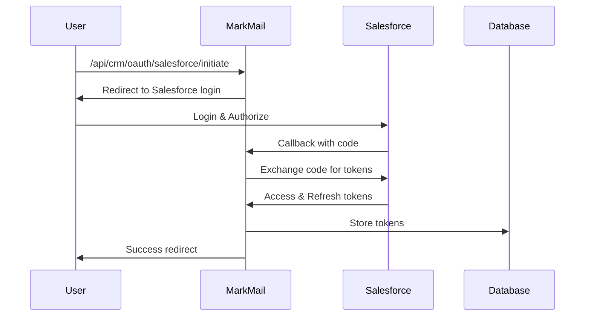

# Salesforce OAuth2 認証

このドキュメントでは、MarkMailのSalesforce
OAuth2認証の実装と設定方法について説明します。

## 概要

MarkMailは、Salesforce OAuth2 Web Server
Flowを使用してSalesforceと連携します。この認証フローにより、ユーザーの認証情報を直接扱うことなく、安全にSalesforce
APIにアクセスできます。

## OAuth2フローの仕組み



## 実装詳細

### 1. OAuth2設定構造

```rust
// backend/src/crm/oauth/salesforce_oauth.rs
pub struct SalesforceOAuthSettings {
    pub client_id: String,
    pub client_secret: String,
    pub redirect_url: String,
    pub auth_url: String,
    pub token_url: String,
    pub use_sandbox: bool,
}
```

### 2. 認証URLの生成

```rust
pub fn generate_auth_url(&self) -> (String, String) {
    let state = Uuid::new_v4().to_string();
    let params = [
        ("response_type", "code"),
        ("client_id", &self.settings.client_id),
        ("redirect_uri", &self.settings.redirect_url),
        ("state", &state),
    ];

    let auth_url = format!(
        "{}?{}",
        self.settings.auth_url,
        serde_urlencoded::to_string(&params).unwrap()
    );

    (auth_url, state)
}
```

### 3. トークン交換

重要:
Salesforceのトークンレスポンスには`instance_url`が含まれており、これを使用してAPI呼び出しを行う必要があります。

```rust
pub async fn exchange_code(&self, code: String) -> Result<SalesforceTokenResponse, String> {
    let params = [
        ("grant_type", "authorization_code"),
        ("code", &code),
        ("client_id", &self.settings.client_id),
        ("client_secret", &self.settings.client_secret),
        ("redirect_uri", &self.settings.redirect_url),
    ];

    let response = self
        .http_client
        .post(&self.settings.token_url)
        .form(&params)
        .send()
        .await
        .map_err(|e| format!("Token exchange request failed: {e}"))?;

    // レスポンスにはinstance_urlが含まれる
    let tokens: SalesforceTokenResponse = response.json().await
        .map_err(|e| format!("Failed to parse token response: {e}"))?;

    Ok(tokens)
}
```

## 環境別設定

### ローカル環境

`.env`ファイルに以下を設定:

```bash
# Salesforce OAuth2
SALESFORCE_CLIENT_ID=your_consumer_key
SALESFORCE_CLIENT_SECRET=your_consumer_secret
SALESFORCE_REDIRECT_URL=http://localhost:3000/api/crm/oauth/salesforce/callback
SALESFORCE_USE_SANDBOX=true
```

### AWS環境

AWS Secrets Managerで`markmail-{env}-salesforce-secret`を作成:

```json
{
  "client_id": "your_production_consumer_key",
  "client_secret": "your_production_consumer_secret",
  "redirect_url": "https://dev.markmail.engineers-hub.ltd/api/crm/oauth/salesforce/callback",
  "use_sandbox": "false"
}
```

## Salesforceアプリ設定

### 1. Connected Appの作成

1. Salesforce Setup → App Manager → New Connected App
2. 以下を設定:
   - **Connected App Name**: MarkMail Integration
   - **API Name**: MarkMail_Integration
   - **Contact Email**: your-email@example.com
   - **Enable OAuth Settings**: ✓
   - **Callback URL**:
     ```
     http://localhost:3000/api/crm/oauth/salesforce/callback
     https://dev.markmail.engineers-hub.ltd/api/crm/oauth/salesforce/callback
     ```
   - **Selected OAuth Scopes**:
     - Access and manage your data (api)
     - Perform requests on your behalf at any time (refresh_token,
       offline_access)
     - Access your basic information (id, profile, email, address, phone)

### 2. Consumer Key/Secretの取得

1. 作成後、"Manage Consumer Details"をクリック
2. Consumer KeyとConsumer Secretをコピー
3. 環境変数に設定

## トークン管理

### トークンの保存

```rust
// backend/src/crm/oauth/token_manager.rs
pub async fn store_salesforce_tokens(
    pool: &PgPool,
    user_id: Uuid,
    provider: &str,
    tokens: &SalesforceTokenResponse,
) -> Result<(), String> {
    let instance_url = tokens
        .instance_url
        .as_ref()
        .ok_or("Instance URL not found in token response")?;

    sqlx::query!(
        r#"
        INSERT INTO crm_integrations
        (id, user_id, provider, access_token, refresh_token,
         expires_at, instance_url, created_at, updated_at)
        VALUES ($1, $2, $3, $4, $5, $6, $7, NOW(), NOW())
        ON CONFLICT (user_id, provider)
        DO UPDATE SET
            access_token = EXCLUDED.access_token,
            refresh_token = EXCLUDED.refresh_token,
            expires_at = EXCLUDED.expires_at,
            instance_url = EXCLUDED.instance_url,
            updated_at = NOW()
        "#,
        Uuid::new_v4(),
        user_id,
        provider,
        &tokens.access_token,
        tokens.refresh_token.as_deref(),
        expires_at,
        instance_url,
    )
    .execute(pool)
    .await
    .map_err(|e| format!("Failed to store tokens: {e}"))?;

    Ok(())
}
```

### トークンのリフレッシュ

```rust
pub async fn refresh_salesforce_token(
    client: &reqwest::Client,
    refresh_token: &str,
    settings: &SalesforceOAuthSettings,
) -> Result<SalesforceTokenResponse, String> {
    let params = [
        ("grant_type", "refresh_token"),
        ("refresh_token", refresh_token),
        ("client_id", &settings.client_id),
        ("client_secret", &settings.client_secret),
    ];

    let response = client
        .post(&settings.token_url)
        .form(&params)
        .send()
        .await
        .map_err(|e| format!("Refresh token request failed: {e}"))?;

    let tokens: SalesforceTokenResponse = response.json().await
        .map_err(|e| format!("Failed to parse refresh response: {e}"))?;

    Ok(tokens)
}
```

## テストスクリプト

### OAuth2フローのテスト

```bash
# 認証URLの生成とコールバック処理
python scripts/salesforce-integration/testing/oauth2_flow.py

# cURLでの直接テスト
bash scripts/salesforce-integration/testing/test_oauth_curl.sh
```

### 認証状態の確認

```python
# scripts/salesforce-integration/testing/complete_oauth_callback.py
import requests

# 保存されたトークンの確認
response = requests.get(
    "http://localhost:3000/api/crm/salesforce/me",
    headers={"Authorization": f"Bearer {jwt_token}"}
)
print(response.json())
```

## トラブルシューティング

### よくあるエラー

1. **invalid_client: invalid client credentials**

   - Consumer Key/Secretが正しいか確認
   - Sandbox/Production環境の設定を確認

2. **redirect_uri_mismatch**

   - Connected AppのCallback URLに全ての環境のURLが登録されているか確認
   - URLが完全一致しているか確認（末尾のスラッシュも含む）

3. **Missing_OAuth_Token**
   - トークンがデータベースに保存されているか確認
   - instance_urlが正しく保存されているか確認

### ログの確認

```bash
# バックエンドログ
docker logs markmail-backend-1

# AWS CloudWatchログ
aws logs tail /ecs/markmail-dev-backend --follow
```

## セキュリティ注意事項

1. **Consumer Secretの管理**

   - 本番環境では必ずSecrets Managerを使用
   - ログに出力しない
   - コードにハードコードしない

2. **Refresh Tokenの取り扱い**

   - 暗号化して保存を検討
   - 定期的な更新を実装

3. **スコープの最小化**
   - 必要最小限のOAuthスコープのみを要求
   - 定期的にスコープを見直し

## 関連ドキュメント

- [Salesforce OAuth 2.0 Documentation](https://help.salesforce.com/s/articleView?id=sf.remoteaccess_oauth_web_server_flow.htm)
- [Connected Apps](https://help.salesforce.com/s/articleView?id=sf.connected_app_overview.htm)
- [実装仕様書](./oauth2-implementation-spec.md)
