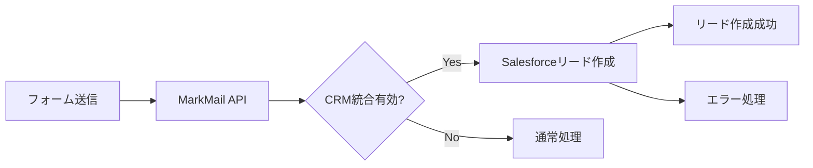

# Salesforceリード管理

このドキュメントでは、MarkMailからSalesforceへのリード作成と管理について説明します。

## 概要

MarkMailは、フォーム送信データを自動的にSalesforceのリードとして作成します。この統合により、見込み顧客情報を一元管理し、営業プロセスを効率化できます。

## リード作成フロー



## 実装詳細

### 1. リード作成サービス

```rust
// backend/src/crm/salesforce/lead_service.rs
pub struct LeadService {
    client: Arc<reqwest::Client>,
}

impl LeadService {
    pub async fn create_lead(
        &self,
        instance_url: &str,
        access_token: &str,
        lead_data: &CreateLeadRequest,
    ) -> Result<CreateLeadResponse, String> {
        let url = format!("{}/services/data/v59.0/sobjects/Lead", instance_url);

        let response = self
            .client
            .post(&url)
            .header("Authorization", format!("Bearer {}", access_token))
            .header("Content-Type", "application/json")
            .json(lead_data)
            .send()
            .await
            .map_err(|e| format!("Failed to send request: {e}"))?;

        if response.status().is_success() {
            let result: CreateLeadResponse = response.json().await
                .map_err(|e| format!("Failed to parse response: {e}"))?;
            Ok(result)
        } else {
            let error_text = response.text().await.unwrap_or_default();
            Err(format!("Lead creation failed: {}", error_text))
        }
    }
}
```

### 2. リードデータ構造

```rust
#[derive(Debug, Serialize, Deserialize)]
pub struct CreateLeadRequest {
    #[serde(rename = "FirstName")]
    pub first_name: Option<String>,

    #[serde(rename = "LastName")]
    pub last_name: String,

    #[serde(rename = "Email")]
    pub email: Option<String>,

    #[serde(rename = "Company")]
    pub company: String,

    #[serde(rename = "Phone")]
    pub phone: Option<String>,

    #[serde(rename = "LeadSource")]
    pub lead_source: Option<String>,

    #[serde(rename = "Description")]
    pub description: Option<String>,

    // カスタムフィールド
    #[serde(rename = "Engineer_Skills__c")]
    pub engineer_skills: Option<String>,

    #[serde(rename = "Years_of_Experience__c")]
    pub years_of_experience: Option<f64>,
}
```

### 3. フォーム送信からのリード作成

```rust
// backend/src/api/forms.rs
pub async fn handle_form_submission(
    pool: &PgPool,
    form_id: Uuid,
    submission_data: HashMap<String, Value>,
) -> Result<(), String> {
    // フォーム送信を保存
    let submission_id = save_form_submission(pool, form_id, &submission_data).await?;

    // CRM統合設定を確認
    let form_settings = get_form_settings(pool, form_id).await?;

    if form_settings.crm_integration_enabled {
        // Salesforceリード作成
        create_salesforce_lead_from_submission(
            pool,
            form_settings.user_id,
            &submission_data
        ).await?;
    }

    Ok(())
}
```

## フィールドマッピング

### 標準フィールド

| フォームフィールド | Salesforceフィールド | 必須 | 説明               |
| ------------------ | -------------------- | ---- | ------------------ |
| name               | LastName             | Yes  | 姓（分割して使用） |
| first_name         | FirstName            | No   | 名                 |
| email              | Email                | No   | メールアドレス     |
| company            | Company              | Yes  | 会社名             |
| phone              | Phone                | No   | 電話番号           |
| message            | Description          | No   | 問い合わせ内容     |

### カスタムフィールド

カスタムフィールドは`__c`サフィックスが付きます：

```json
{
  "Engineer_Skills__c": "React, TypeScript, Node.js",
  "Years_of_Experience__c": 5,
  "Project_Budget__c": "50000",
  "Preferred_Contact_Method__c": "Email"
}
```

## Salesforce設定

### 1. カスタムフィールドの作成

1. Setup → Object Manager → Lead
2. Fields & Relationships → New
3. 以下のフィールドを作成:
   - Engineer Skills (Text Area)
   - Years of Experience (Number)
   - Project Budget (Currency)
   - Preferred Contact Method (Picklist)

### 2. フィールドレベルセキュリティ

各カスタムフィールドに対して:

1. Field Accessibility → Set Field-Level Security
2. 統合ユーザープロファイルに対して「Visible」と「Read-Only」を設定

### 3. ページレイアウト

1. Page Layouts → Lead Layout
2. カスタムフィールドセクションを追加
3. 必要なフィールドをドラッグ&ドロップ

## リード作成API

### エンドポイント

```
POST /api/crm/salesforce/leads
```

### リクエスト例

```json
{
  "first_name": "太郎",
  "last_name": "山田",
  "email": "yamada@example.com",
  "company": "株式会社Example",
  "phone": "03-1234-5678",
  "lead_source": "Web Form",
  "description": "新規プロジェクトの相談",
  "custom_fields": {
    "Engineer_Skills__c": "React, AWS",
    "Years_of_Experience__c": 5
  }
}
```

### レスポンス例

```json
{
  "id": "00Q5g00000XXXXXX",
  "success": true,
  "errors": []
}
```

## エラーハンドリング

### 一般的なエラー

1. **Required fields are missing: [Last Name]**

   - 必須フィールドが不足
   - LastNameとCompanyは必須

2. **Bad value for restricted picklist field**

   - ピックリスト値が無効
   - Salesforceで定義された値のみ使用可能

3. **Field Engineer_Skills\_\_c is not accessible**
   - フィールドレベルセキュリティの問題
   - 統合ユーザーの権限を確認

### エラー処理実装

```rust
match lead_service.create_lead(&instance_url, &access_token, &lead_data).await {
    Ok(response) => {
        info!("Lead created successfully: {}", response.id);
        Ok(response)
    }
    Err(e) => {
        error!("Lead creation failed: {}", e);

        // エラータイプによる処理分岐
        if e.contains("INVALID_SESSION_ID") {
            // トークンをリフレッシュして再試行
            refresh_and_retry().await
        } else if e.contains("REQUIRED_FIELD_MISSING") {
            // 必須フィールドエラー
            Err("必須フィールドが不足しています".to_string())
        } else {
            Err(e)
        }
    }
}
```

## 重複管理

### 重複ルールの設定

1. Setup → Duplicate Management → Duplicate Rules
2. Lead用の重複ルールを作成
3. マッチング条件を設定（Email、Company等）

### APIでの重複チェック

```rust
pub async fn check_duplicate_lead(
    &self,
    instance_url: &str,
    access_token: &str,
    email: &str,
) -> Result<Vec<Lead>, String> {
    let query = format!(
        "SELECT Id, Name, Email, Company FROM Lead WHERE Email = '{}'",
        email
    );

    let encoded_query = urlencoding::encode(&query);
    let url = format!("{}/services/data/v59.0/query?q={}", instance_url, encoded_query);

    // SOQLクエリを実行
    let response = self.client
        .get(&url)
        .header("Authorization", format!("Bearer {}", access_token))
        .send()
        .await?;

    // 結果をパース
    let result: QueryResult<Lead> = response.json().await?;
    Ok(result.records)
}
```

## パフォーマンス向上

### バッチ処理

複数のリードを一度に作成する場合:

```rust
pub async fn create_leads_batch(
    &self,
    instance_url: &str,
    access_token: &str,
    leads: Vec<CreateLeadRequest>,
) -> Result<Vec<CreateLeadResponse>, String> {
    let url = format!("{}/services/data/v59.0/composite/sobjects", instance_url);

    let batch_request = BatchRequest {
        all_or_none: false,
        records: leads,
    };

    let response = self.client
        .post(&url)
        .header("Authorization", format!("Bearer {}", access_token))
        .json(&batch_request)
        .send()
        .await?;

    // バッチ結果を処理
    let results: Vec<CreateLeadResponse> = response.json().await?;
    Ok(results)
}
```

### 非同期処理

フォーム送信時の非同期リード作成:

```rust
// バックグラウンドタスクとして実行
tokio::spawn(async move {
    if let Err(e) = create_salesforce_lead(pool, user_id, lead_data).await {
        error!("Background lead creation failed: {}", e);
        // リトライキューに追加
        add_to_retry_queue(lead_data).await;
    }
});
```

## テストとデバッグ

### フィールド権限チェック

```bash
# カスタムフィールドの権限を確認
python scripts/salesforce-integration/utilities/check_field_permissions.py
```

### ピックリスト値の確認

```bash
# 利用可能なピックリスト値を取得
python scripts/salesforce-integration/utilities/check_picklist_values.py
```

### リード作成テスト

```bash
# フォーム送信によるリード作成テスト
python scripts/salesforce-integration/testing/submit_form_test_dev.py
```

## 関連ドキュメント

- [Salesforce Lead Object Reference](https://developer.salesforce.com/docs/atlas.en-us.object_reference.meta/object_reference/sforce_api_objects_lead.htm)
- [SOQL Query Reference](https://developer.salesforce.com/docs/atlas.en-us.soql_sosl.meta/soql_sosl/)
- [フォーム実装ドキュメント](./engineer-skill-form-implementation-2025-07-29.md)
