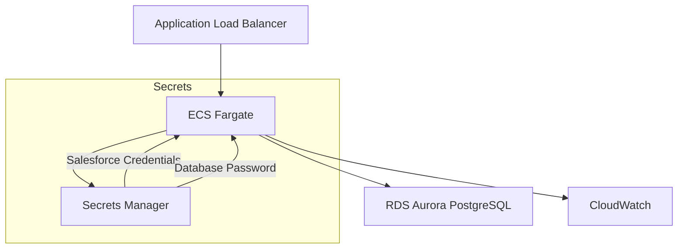

# AWS環境デプロイ

このドキュメントでは、Salesforce統合をAWS環境にデプロイする手順を説明します。

## アーキテクチャ概要



## 前提条件

- AWS CLIがインストール済み
- 適切なAWSプロファイルが設定済み
- AWS CDKがインストール済み（`npm install -g aws-cdk`）

## Secrets Managerの設定

### 1. Salesforceシークレットの作成

```bash
# 開発環境
aws secretsmanager create-secret \
  --name markmail-dev-salesforce-secret \
  --secret-string '{
    "client_id": "your-salesforce-consumer-key",
    "client_secret": "your-salesforce-consumer-secret",
    "redirect_url": "https://dev.markmail.engineers-hub.ltd/api/crm/oauth/salesforce/callback",
    "use_sandbox": "false"
  }' \
  --profile your-profile

# ステージング環境
aws secretsmanager create-secret \
  --name markmail-staging-salesforce-secret \
  --secret-string '{...}' \
  --profile your-profile

# 本番環境
aws secretsmanager create-secret \
  --name markmail-prod-salesforce-secret \
  --secret-string '{...}' \
  --profile your-profile
```

### 2. シークレットの更新

```bash
# スクリプトを使用
cd scripts/salesforce-integration/aws-deployment
./update_aws_secrets.sh dev "new-client-id" "new-client-secret"

# または手動で
aws secretsmanager update-secret \
  --secret-id markmail-dev-salesforce-secret \
  --secret-string '{
    "client_id": "new-client-id",
    "client_secret": "new-client-secret",
    "redirect_url": "https://dev.markmail.engineers-hub.ltd/api/crm/oauth/salesforce/callback",
    "use_sandbox": "false"
  }' \
  --profile your-profile
```

### 3. シークレットの確認

```bash
# 値を確認（注意: 実際のシークレットが表示される）
aws secretsmanager get-secret-value \
  --secret-id markmail-dev-salesforce-secret \
  --query 'SecretString' \
  --output text \
  --profile your-profile | jq '.'
```

## インフラストラクチャのデプロイ

### 1. 環境変数の設定

```bash
# 開発環境
export CDK_CONTEXT_ENVIRONMENT=dev
export DEV_DOMAIN=dev.markmail.engineers-hub.ltd
export NOTIFICATION_EMAIL=your-email@example.com
export GITHUB_OWNER=engineers-hub-ltd-in-house-project
export GITHUB_REPO=markmail
```

### 2. CDKデプロイ

```bash
cd infrastructure

# 依存関係のインストール
npm install

# CDKブートストラップ（初回のみ）
npx cdk bootstrap --profile your-profile

# スタック一覧確認
npx cdk list --profile your-profile

# 全スタックデプロイ
npm run deploy -- --profile your-profile

# 特定スタックのみデプロイ
npx cdk deploy MarkMail-dev-ECSServiceStack --profile your-profile
```

### 3. デプロイ順序

正しいデプロイ順序:

1. NetworkStack
2. DatabaseStack
3. SecretsStack
4. ALBStack
5. ECSClusterStack
6. ECSServiceStack
7. MonitoringStack
8. PipelineStack

## データベース設定

### 1. マイグレーションの実行

ECSタスクは起動時に自動的にマイグレーションを実行しますが、手動実行も可能です。

```bash
# Bastion Host経由での実行
# 1. Bastion Hostを作成
CREATE_BASTION=true npx cdk deploy MarkMail-dev-BastionStack --profile your-profile

# 2. Instance IDを取得
INSTANCE_ID=$(aws ec2 describe-instances \
  --filters "Name=tag:Name,Values=markmail-dev-bastion" \
  --query 'Reservations[*].Instances[*].[InstanceId]' \
  --output text \
  --profile your-profile)

# 3. SSM経由で接続
aws ssm start-session --target $INSTANCE_ID --profile your-profile
```

### 2. CRM統合データの投入

```bash
# RDSエンドポイントを取得
RDS_ENDPOINT=$(aws rds describe-db-instances \
  --query 'DBInstances[?DBInstanceIdentifier==`markmail-dev`].Endpoint.Address' \
  --output text \
  --profile your-profile)

# データベースパスワードを取得
DB_PASSWORD=$(aws secretsmanager get-secret-value \
  --secret-id markmail-dev-db-secret \
  --query 'SecretString' \
  --output text \
  --profile your-profile | jq -r '.password')

# SQLを実行
PGPASSWORD=$DB_PASSWORD psql \
  -h $RDS_ENDPOINT \
  -U markmail \
  -d markmail \
  -f scripts/salesforce-integration/aws-deployment/insert_crm_integration_to_rds.sql
```

## ECSサービス管理

### 1. サービスの再デプロイ

```bash
# 新しいデプロイメントを開始
aws ecs update-service \
  --cluster markmail-dev \
  --service markmail-dev-backend \
  --desired-count 2 \
  --profile your-profile

# タスク数を戻す
aws ecs update-service \
  --cluster markmail-dev \
  --service markmail-dev-backend \
  --desired-count 1 \
  --profile your-profile
```

### 2. タスク定義の更新

```bash
# 環境変数を追加する場合
# infrastructure/lib/stacks/ecs-service-stack.tsを編集後
npx cdk deploy MarkMail-dev-ECSServiceStack --profile your-profile
```

### 3. ログの確認

```bash
# CloudWatchログの確認
aws logs tail /ecs/markmail-dev-backend --follow --profile your-profile

# 特定時間のログ
aws logs filter-log-events \
  --log-group-name /ecs/markmail-dev-backend \
  --start-time $(date -d '1 hour ago' +%s)000 \
  --profile your-profile
```

## ALB設定

### 1. ヘルスチェック設定

```typescript
// infrastructure/lib/stacks/alb-stack.ts
targetGroup.configureHealthCheck({
  path: '/health',
  interval: cdk.Duration.seconds(30),
  timeout: cdk.Duration.seconds(5),
  healthyThresholdCount: 2,
  unhealthyThresholdCount: 3,
});
```

### 2. パスベースルーティング

```typescript
// APIパス
listener.addTargets('ApiTarget', {
  pathPatterns: ['/api/*'],
  priority: 1,
  targetGroups: [backendTargetGroup],
});

// フロントエンドパス
listener.addTargets('FrontendTarget', {
  pathPatterns: ['/*'],
  priority: 2,
  targetGroups: [frontendTargetGroup],
});
```

## モニタリング設定

### 1. CloudWatchダッシュボード

```bash
# ダッシュボードURL
https://console.aws.amazon.com/cloudwatch/home?region=ap-northeast-1#dashboards:name=MarkMail-dev
```

主要メトリクス:

- ECS Task CPU/Memory使用率
- ALB Request Count
- RDS接続数
- API応答時間

### 2. アラーム設定

```typescript
// infrastructure/lib/stacks/monitoring-stack.ts
new cloudwatch.Alarm(this, 'HighErrorRate', {
  metric: new cloudwatch.Metric({
    namespace: 'AWS/ApplicationELB',
    metricName: 'HTTPCode_Target_5XX_Count',
    dimensionsMap: {
      LoadBalancer: alb.loadBalancerFullName,
    },
  }),
  threshold: 10,
  evaluationPeriods: 2,
});
```

## CI/CDパイプライン

### 1. CodePipelineの設定

```bash
# パイプラインの手動実行
aws codepipeline start-pipeline-execution \
  --name markmail-dev-pipeline \
  --profile your-profile

# 実行状態の確認
aws codepipeline get-pipeline-state \
  --name markmail-dev-pipeline \
  --profile your-profile
```

### 2. ビルドスペック

```yaml
# buildspec.yml
version: 0.2
phases:
  pre_build:
    commands:
      - echo Logging in to Amazon ECR...
      - aws ecr get-login-password --region $AWS_DEFAULT_REGION | docker login
        --username AWS --password-stdin
        $AWS_ACCOUNT_ID.dkr.ecr.$AWS_DEFAULT_REGION.amazonaws.com
  build:
    commands:
      - echo Build started on `date`
      - docker build -f backend/Dockerfile -t $IMAGE_REPO_NAME:$IMAGE_TAG
        backend/
      - docker tag $IMAGE_REPO_NAME:$IMAGE_TAG
        $AWS_ACCOUNT_ID.dkr.ecr.$AWS_DEFAULT_REGION.amazonaws.com/$IMAGE_REPO_NAME:$IMAGE_TAG
  post_build:
    commands:
      - echo Build completed on `date`
      - docker push
        $AWS_ACCOUNT_ID.dkr.ecr.$AWS_DEFAULT_REGION.amazonaws.com/$IMAGE_REPO_NAME:$IMAGE_TAG
```

## トラブルシューティング

### ECSタスクが起動しない

```bash
# タスクの状態確認
aws ecs describe-tasks \
  --cluster markmail-dev \
  --tasks $(aws ecs list-tasks --cluster markmail-dev --query 'taskArns[0]' --output text) \
  --profile your-profile

# 停止理由の確認
aws ecs describe-tasks \
  --cluster markmail-dev \
  --tasks $(aws ecs list-tasks --cluster markmail-dev --desired-status STOPPED --query 'taskArns[0]' --output text) \
  --query 'tasks[0].stoppedReason' \
  --profile your-profile
```

### Secrets Managerアクセスエラー

```bash
# ECSタスクロールの確認
aws iam get-role-policy \
  --role-name markmail-dev-task-role \
  --policy-name SecretsManagerAccess \
  --profile your-profile
```

### データベース接続エラー

```bash
# セキュリティグループの確認
aws ec2 describe-security-groups \
  --group-ids sg-xxxxxxxxx \
  --query 'SecurityGroups[0].IpPermissions' \
  --profile your-profile
```

## 運用上の注意点

### 1. 環境の分離

- 開発（dev）: 日々の開発とテスト
- ステージング（staging）: リリース前の検証
- 本番（prod）: 実際のユーザー環境

### 2. シークレット管理

- Secrets Managerでの一元管理
- 定期的なローテーション
- 環境ごとの分離

### 3. 監視とアラート

- CloudWatchダッシュボードの活用
- 重要メトリクスのアラーム設定
- ログの定期的な確認

### 4. バックアップ

- RDSの自動バックアップ
- 重要データの定期的なエクスポート
- リストアテストの実施

## 関連ドキュメント

- [AWS CDK Documentation](https://docs.aws.amazon.com/cdk/latest/guide/)
- [ECS Best Practices Guide](https://docs.aws.amazon.com/AmazonECS/latest/bestpracticesguide/)
- [インフラストラクチャコード](../../infrastructure/)
