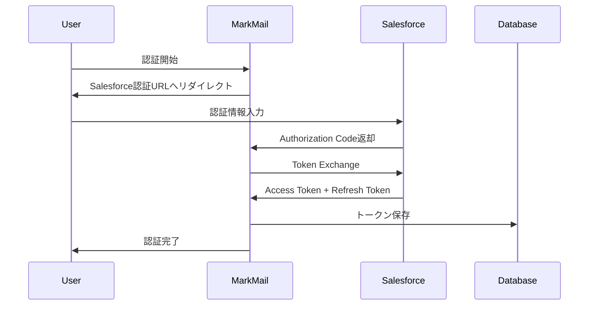

# Salesforce OAuth2実装技術仕様書

## 1. 概要

本仕様書は、MarkMailシステムにおけるSalesforce
OAuth2認証の実装詳細を定義します。

## 2. システム構成

### 2.1 認証フロー

OAuth 2.0 Web Server Flow with Refresh Tokenを採用します。



### 2.2 トークン管理

- Access Token: 2時間有効
- Refresh Token: 無期限（明示的な取り消しまで有効）
- 自動更新: Access Token期限切れ時に自動でRefresh

## 3. 実装詳細

### 3.1 ディレクトリ構造

```
backend/src/
├── crm/
│   ├── oauth/
│   │   ├── mod.rs
│   │   ├── salesforce_oauth.rs
│   │   └── token_manager.rs
│   └── providers/
│       └── salesforce.rs (既存、OAuth対応に修正)
├── api/
│   └── crm/
│       └── oauth.rs (新規エンドポイント)
└── models/
    └── crm/
        └── oauth.rs (新規モデル)
```

### 3.2 データベーススキーマ

```sql
-- OAuth認証情報テーブル
CREATE TABLE salesforce_oauth_tokens (
    id UUID PRIMARY KEY DEFAULT uuid_generate_v4(),
    user_id UUID REFERENCES users(id) ON DELETE CASCADE,
    access_token TEXT NOT NULL,
    refresh_token TEXT NOT NULL,
    instance_url TEXT NOT NULL,
    token_type VARCHAR(50) NOT NULL DEFAULT 'Bearer',
    expires_at TIMESTAMP WITH TIME ZONE NOT NULL,
    created_at TIMESTAMP WITH TIME ZONE DEFAULT CURRENT_TIMESTAMP,
    updated_at TIMESTAMP WITH TIME ZONE DEFAULT CURRENT_TIMESTAMP,
    UNIQUE(user_id)
);

-- トークン更新ログ
CREATE TABLE salesforce_token_refresh_logs (
    id UUID PRIMARY KEY DEFAULT uuid_generate_v4(),
    user_id UUID REFERENCES users(id) ON DELETE CASCADE,
    status VARCHAR(20) NOT NULL, -- 'success' or 'failure'
    error_message TEXT,
    refreshed_at TIMESTAMP WITH TIME ZONE DEFAULT CURRENT_TIMESTAMP
);
```

### 3.3 OAuth2クライアント実装

#### 3.3.1 Cargo.toml追加依存関係

```toml
[dependencies]
oauth2 = "5.0"
```

#### 3.3.2 OAuth設定構造体

```rust
// backend/src/crm/oauth/mod.rs
use oauth2::{
    AuthorizationCode, ClientId, ClientSecret, CsrfToken,
    PkceCodeChallenge, PkceCodeVerifier, RedirectUrl,
    RefreshToken, Scope, TokenUrl
};
use serde::{Deserialize, Serialize};

#[derive(Clone)]
pub struct SalesforceOAuthConfig {
    pub client_id: ClientId,
    pub client_secret: ClientSecret,
    pub auth_url: String,
    pub token_url: TokenUrl,
    pub redirect_url: RedirectUrl,
}

impl SalesforceOAuthConfig {
    pub fn from_env() -> Result<Self, String> {
        Ok(Self {
            client_id: ClientId::new(
                std::env::var("SALESFORCE_CLIENT_ID")
                    .map_err(|_| "SALESFORCE_CLIENT_ID not set")?
            ),
            client_secret: ClientSecret::new(
                std::env::var("SALESFORCE_CLIENT_SECRET")
                    .map_err(|_| "SALESFORCE_CLIENT_SECRET not set")?
            ),
            auth_url: "https://login.salesforce.com/services/oauth2/authorize".to_string(),
            token_url: TokenUrl::new(
                "https://login.salesforce.com/services/oauth2/token".to_string()
            ).map_err(|e| e.to_string())?,
            redirect_url: RedirectUrl::new(
                std::env::var("SALESFORCE_REDIRECT_URI")
                    .map_err(|_| "SALESFORCE_REDIRECT_URI not set")?
            ).map_err(|e| e.to_string())?,
        })
    }
}
```

#### 3.3.3 認証フロー実装

```rust
// backend/src/crm/oauth/salesforce_oauth.rs
use oauth2::{
    AuthUrl, AuthorizationCode, ClientId, ClientSecret, CsrfToken,
    RedirectUrl, Scope, TokenResponse, TokenUrl,
    basic::BasicClient, reqwest::async_http_client,
};
use uuid::Uuid;

pub struct SalesforceOAuthClient {
    client: BasicClient,
    config: SalesforceOAuthConfig,
}

impl SalesforceOAuthClient {
    pub fn new(config: SalesforceOAuthConfig) -> Result<Self, String> {
        let client = BasicClient::new(
            config.client_id.clone(),
            Some(config.client_secret.clone()),
            AuthUrl::new(config.auth_url.clone()).map_err(|e| e.to_string())?,
            Some(config.token_url.clone()),
        )
        .set_redirect_uri(config.redirect_url.clone());

        Ok(Self { client, config })
    }

    /// 認証URLを生成
    pub fn get_auth_url(&self) -> (String, CsrfToken) {
        let (auth_url, csrf_token) = self
            .client
            .authorize_url(CsrfToken::new_random)
            .add_scope(Scope::new("api".to_string()))
            .add_scope(Scope::new("refresh_token".to_string()))
            .add_scope(Scope::new("offline_access".to_string()))
            .url();

        (auth_url.to_string(), csrf_token)
    }

    /// Authorization Codeをトークンに交換
    pub async fn exchange_code(
        &self,
        code: String,
    ) -> Result<SalesforceTokenResponse, String> {
        let token_response = self
            .client
            .exchange_code(AuthorizationCode::new(code))
            .request_async(async_http_client)
            .await
            .map_err(|e| format!("Token exchange failed: {}", e))?;

        Ok(SalesforceTokenResponse {
            access_token: token_response.access_token().secret().to_string(),
            refresh_token: token_response
                .refresh_token()
                .map(|t| t.secret().to_string()),
            token_type: token_response.token_type().as_ref().to_string(),
            expires_in: token_response.expires_in().map(|d| d.as_secs()),
            instance_url: None, // Salesforceの追加レスポンスから取得
        })
    }

    /// リフレッシュトークンを使用してアクセストークンを更新
    pub async fn refresh_token(
        &self,
        refresh_token: &str,
    ) -> Result<SalesforceTokenResponse, String> {
        let token_response = self
            .client
            .exchange_refresh_token(&RefreshToken::new(refresh_token.to_string()))
            .request_async(async_http_client)
            .await
            .map_err(|e| format!("Token refresh failed: {}", e))?;

        Ok(SalesforceTokenResponse {
            access_token: token_response.access_token().secret().to_string(),
            refresh_token: None, // リフレッシュ時は新しいリフレッシュトークンは返されない
            token_type: token_response.token_type().as_ref().to_string(),
            expires_in: token_response.expires_in().map(|d| d.as_secs()),
            instance_url: None,
        })
    }
}

#[derive(Debug, Serialize, Deserialize)]
pub struct SalesforceTokenResponse {
    pub access_token: String,
    pub refresh_token: Option<String>,
    pub token_type: String,
    pub expires_in: Option<u64>,
    pub instance_url: Option<String>,
}
```

### 3.4 トークン管理実装

```rust
// backend/src/crm/oauth/token_manager.rs
use chrono::{DateTime, Duration, Utc};
use sqlx::PgPool;
use uuid::Uuid;

pub struct TokenManager {
    pool: PgPool,
    oauth_client: SalesforceOAuthClient,
}

impl TokenManager {
    pub fn new(pool: PgPool, oauth_client: SalesforceOAuthClient) -> Self {
        Self { pool, oauth_client }
    }

    /// トークンを保存
    pub async fn save_tokens(
        &self,
        user_id: Uuid,
        tokens: &SalesforceTokenResponse,
        instance_url: &str,
    ) -> Result<(), sqlx::Error> {
        let expires_at = Utc::now() + Duration::seconds(
            tokens.expires_in.unwrap_or(7200) as i64
        );

        sqlx::query!(
            r#"
            INSERT INTO salesforce_oauth_tokens
            (user_id, access_token, refresh_token, instance_url, token_type, expires_at)
            VALUES ($1, $2, $3, $4, $5, $6)
            ON CONFLICT (user_id)
            DO UPDATE SET
                access_token = EXCLUDED.access_token,
                refresh_token = EXCLUDED.refresh_token,
                instance_url = EXCLUDED.instance_url,
                expires_at = EXCLUDED.expires_at,
                updated_at = CURRENT_TIMESTAMP
            "#,
            user_id,
            tokens.access_token,
            tokens.refresh_token.as_ref().unwrap(),
            instance_url,
            tokens.token_type,
            expires_at,
        )
        .execute(&self.pool)
        .await?;

        Ok(())
    }

    /// 有効なアクセストークンを取得（必要に応じて自動更新）
    pub async fn get_valid_access_token(
        &self,
        user_id: Uuid,
    ) -> Result<String, String> {
        let token_info = sqlx::query!(
            r#"
            SELECT access_token, refresh_token, expires_at
            FROM salesforce_oauth_tokens
            WHERE user_id = $1
            "#,
            user_id
        )
        .fetch_optional(&self.pool)
        .await
        .map_err(|e| format!("Database error: {}", e))?
        .ok_or_else(|| "No token found for user".to_string())?;

        // トークンの有効期限を確認
        let expires_at: DateTime<Utc> = token_info.expires_at;
        let now = Utc::now();

        if expires_at > now + Duration::minutes(5) {
            // まだ有効（5分の余裕を持って判定）
            Ok(token_info.access_token)
        } else {
            // 期限切れまたは期限切れ間近 - リフレッシュ
            self.refresh_and_save_token(user_id, &token_info.refresh_token).await
        }
    }

    /// トークンをリフレッシュして保存
    async fn refresh_and_save_token(
        &self,
        user_id: Uuid,
        refresh_token: &str,
    ) -> Result<String, String> {
        match self.oauth_client.refresh_token(refresh_token).await {
            Ok(new_tokens) => {
                // 新しいトークンを保存
                let instance_url = self.get_instance_url(user_id).await?;
                self.save_tokens(user_id, &new_tokens, &instance_url)
                    .await
                    .map_err(|e| format!("Failed to save refreshed token: {}", e))?;

                // ログを記録
                self.log_refresh_attempt(user_id, true, None).await;

                Ok(new_tokens.access_token)
            }
            Err(e) => {
                self.log_refresh_attempt(user_id, false, Some(&e)).await;
                Err(format!("Token refresh failed: {}", e))
            }
        }
    }

    async fn get_instance_url(&self, user_id: Uuid) -> Result<String, String> {
        sqlx::query_scalar!(
            "SELECT instance_url FROM salesforce_oauth_tokens WHERE user_id = $1",
            user_id
        )
        .fetch_one(&self.pool)
        .await
        .map_err(|e| format!("Failed to get instance URL: {}", e))
    }

    async fn log_refresh_attempt(
        &self,
        user_id: Uuid,
        success: bool,
        error: Option<&str>,
    ) {
        let status = if success { "success" } else { "failure" };

        let _ = sqlx::query!(
            r#"
            INSERT INTO salesforce_token_refresh_logs
            (user_id, status, error_message)
            VALUES ($1, $2, $3)
            "#,
            user_id,
            status,
            error
        )
        .execute(&self.pool)
        .await;
    }
}
```

### 3.5 APIエンドポイント実装

```rust
// backend/src/api/crm/oauth.rs
use axum::{
    extract::{Query, State},
    response::{IntoResponse, Redirect},
    Json,
};
use serde::{Deserialize, Serialize};
use uuid::Uuid;

#[derive(Deserialize)]
pub struct AuthCallbackQuery {
    code: String,
    state: String,
}

#[derive(Serialize)]
pub struct AuthInitResponse {
    auth_url: String,
    state: String,
}

/// OAuth認証を開始
pub async fn init_salesforce_auth(
    State(state): State<AppState>,
    Extension(user_id): Extension<Uuid>,
) -> Result<Json<AuthInitResponse>, ApiError> {
    let (auth_url, csrf_token) = state.salesforce_oauth_client.get_auth_url();

    // CSRFトークンをセッションに保存（Redis使用）
    state.redis_client
        .set_ex(
            &format!("oauth_state:{}", csrf_token.secret()),
            &user_id.to_string(),
            300, // 5分間有効
        )
        .await?;

    Ok(Json(AuthInitResponse {
        auth_url,
        state: csrf_token.secret().to_string(),
    }))
}

/// OAuth認証コールバック
pub async fn salesforce_auth_callback(
    State(state): State<AppState>,
    Query(params): Query<AuthCallbackQuery>,
) -> Result<impl IntoResponse, ApiError> {
    // CSRFトークン検証
    let user_id_str = state.redis_client
        .get(&format!("oauth_state:{}", params.state))
        .await?
        .ok_or_else(|| ApiError::BadRequest("Invalid state parameter".to_string()))?;

    let user_id = Uuid::parse_str(&user_id_str)
        .map_err(|_| ApiError::BadRequest("Invalid user ID".to_string()))?;

    // Authorization Codeをトークンに交換
    let tokens = state.salesforce_oauth_client
        .exchange_code(params.code)
        .await
        .map_err(|e| ApiError::BadRequest(format!("Token exchange failed: {}", e)))?;

    // Salesforceインスタンス情報を取得
    let instance_url = get_salesforce_instance_url(&tokens.access_token).await?;

    // トークンを保存
    state.token_manager
        .save_tokens(user_id, &tokens, &instance_url)
        .await
        .map_err(|e| ApiError::InternalError(format!("Failed to save tokens: {}", e)))?;

    // 成功画面へリダイレクト
    Ok(Redirect::to("/crm/oauth/success"))
}

/// 現在の認証状態を確認
pub async fn check_salesforce_auth_status(
    State(state): State<AppState>,
    Extension(user_id): Extension<Uuid>,
) -> Result<Json<AuthStatusResponse>, ApiError> {
    let is_authenticated = sqlx::query_scalar!(
        "SELECT EXISTS(SELECT 1 FROM salesforce_oauth_tokens WHERE user_id = $1)",
        user_id
    )
    .fetch_one(&state.pool)
    .await?
    .unwrap_or(false);

    Ok(Json(AuthStatusResponse { is_authenticated }))
}

#[derive(Serialize)]
pub struct AuthStatusResponse {
    is_authenticated: bool,
}

/// Salesforceインスタンス情報を取得
async fn get_salesforce_instance_url(access_token: &str) -> Result<String, ApiError> {
    #[derive(Deserialize)]
    struct UserInfo {
        urls: UrlInfo,
    }

    #[derive(Deserialize)]
    struct UrlInfo {
        rest: String,
    }

    let client = reqwest::Client::new();
    let response = client
        .get("https://login.salesforce.com/services/oauth2/userinfo")
        .bearer_auth(access_token)
        .send()
        .await
        .map_err(|e| ApiError::InternalError(format!("Failed to get user info: {}", e)))?;

    let user_info: UserInfo = response.json().await
        .map_err(|e| ApiError::InternalError(format!("Failed to parse user info: {}", e)))?;

    // RESTエンドポイントからインスタンスURLを抽出
    let instance_url = user_info.urls.rest
        .split("/services/data/")
        .next()
        .ok_or_else(|| ApiError::InternalError("Invalid instance URL format".to_string()))?
        .to_string();

    Ok(instance_url)
}
```

### 3.6 既存Salesforceプロバイダーの更新

```rust
// backend/src/crm/providers/salesforce.rs の更新部分
impl SalesforceProvider {
    /// OAuth認証を使用してAPIリクエストを実行
    pub async fn execute_with_oauth<T>(
        &self,
        user_id: Uuid,
        request_builder: impl Fn(&str, &str) -> reqwest::RequestBuilder,
    ) -> Result<T, CrmError>
    where
        T: serde::de::DeserializeOwned,
    {
        let token_manager = self.get_token_manager()?;
        let access_token = token_manager
            .get_valid_access_token(user_id)
            .await
            .map_err(|e| CrmError::Authentication(e))?;

        let instance_url = self.get_instance_url(user_id).await?;

        let response = request_builder(&instance_url, &access_token)
            .send()
            .await
            .map_err(|e| CrmError::ApiRequest(e.to_string()))?;

        if response.status().is_success() {
            response.json().await
                .map_err(|e| CrmError::ApiResponse(e.to_string()))
        } else {
            let error_text = response.text().await.unwrap_or_default();
            Err(CrmError::ApiResponse(format!("API error: {}", error_text)))
        }
    }
}
```

## 4. セキュリティ考慮事項

### 4.1 CSRF対策

- State パラメータを使用してCSRF攻撃を防止
- State トークンは一度のみ使用可能（5分間有効）

### 4.2 トークン保護

- アクセストークンとリフレッシュトークンはデータベースに暗号化して保存
- トークンはHTTPSでのみ送信
- ログにトークン情報を出力しない

### 4.3 スコープ制限

必要最小限のスコープのみを要求：

- `api`: Salesforce APIへの基本アクセス
- `refresh_token`: リフレッシュトークンの取得
- `offline_access`: オフラインアクセス

### 4.4 エラーハンドリング

- 認証エラーは詳細情報を含めない汎用的なメッセージを返す
- ログには詳細情報を記録するが、センシティブ情報は除外

## 5. 環境変数設定

```env
# Salesforce OAuth設定
SALESFORCE_CLIENT_ID=your_connected_app_client_id
SALESFORCE_CLIENT_SECRET=your_connected_app_client_secret
SALESFORCE_REDIRECT_URI=https://your-domain.com/api/crm/oauth/salesforce/callback

# Redis設定（CSRF token保存用）
REDIS_URL=redis://localhost:6379
```

## 6. デプロイメント考慮事項

### 6.1 AWS環境での設定

- Secrets Managerで認証情報を管理
- ECS Task RoleにSecrets Manager読み取り権限を付与
- ALBでHTTPS終端を行い、バックエンドへはHTTPで通信

### 6.2 監視とアラート

- トークンリフレッシュ失敗をCloudWatchメトリクスで監視
- 連続失敗時にSNS経由でアラート送信

### 6.3 バックアップとリカバリ

- トークン情報の定期バックアップ
- 認証情報喪失時の再認証フロー

## 7. テスト戦略

### 7.1 単体テスト

```rust
#[cfg(test)]
mod tests {
    use super::*;
    use mockall::mock;

    #[tokio::test]
    async fn test_token_refresh() {
        // モックセットアップ
        let mut mock_client = MockOAuthClient::new();
        mock_client
            .expect_refresh_token()
            .returning(|_| Ok(SalesforceTokenResponse {
                access_token: "new_access_token".to_string(),
                refresh_token: None,
                token_type: "Bearer".to_string(),
                expires_in: Some(7200),
                instance_url: None,
            }));

        // テスト実行
        let result = mock_client.refresh_token("refresh_token").await;
        assert!(result.is_ok());
    }
}
```

### 7.2 統合テスト

- Salesforce Sandbox環境を使用
- 実際の認証フローをE2Eでテスト
- トークン有効期限のシミュレーション

### 7.3 負荷テスト

- 同時リフレッシュリクエストの処理
- トークン管理のパフォーマンス測定

## 8. 移行計画

### Phase 1: 並行稼働（2週間）

- 新旧両方の認証方式をサポート
- フィーチャーフラグで切り替え

### Phase 2: 段階的移行（2週間）

- 新規ユーザーは新方式のみ
- 既存ユーザーを順次移行

### Phase 3: 完全移行（1週間）

- 旧方式の削除
- モニタリング強化

## 9. トラブルシューティングガイド

### 9.1 よくある問題と対処法

1. **トークンリフレッシュ失敗**

   - 原因: リフレッシュトークンの失効
   - 対処: ユーザーに再認証を要求

2. **CSRF検証エラー**

   - 原因: Stateトークンの期限切れ
   - 対処: 認証フローを最初からやり直し

3. **インスタンスURL取得エラー**
   - 原因: APIバージョンの不一致
   - 対処: Salesforce APIバージョンを確認

### 9.2 ログ確認ポイント

```sql
-- 最近のトークンリフレッシュ失敗を確認
SELECT * FROM salesforce_token_refresh_logs
WHERE status = 'failure'
ORDER BY refreshed_at DESC
LIMIT 10;

-- ユーザーごとのトークン状態を確認
SELECT u.email, t.expires_at, t.updated_at
FROM users u
LEFT JOIN salesforce_oauth_tokens t ON u.id = t.user_id
WHERE t.expires_at < NOW();
```

## 10. 参考資料

- [Salesforce OAuth 2.0 Web Server Flow](https://help.salesforce.com/s/articleView?id=sf.remoteaccess_oauth_web_server_flow.htm)
- [oauth2 crate documentation](https://docs.rs/oauth2/latest/oauth2/)
- [RFC 6749: The OAuth 2.0 Authorization Framework](https://datatracker.ietf.org/doc/html/rfc6749)
- [Salesforce REST API Developer Guide](https://developer.salesforce.com/docs/atlas.en-us.api_rest.meta/api_rest/)
