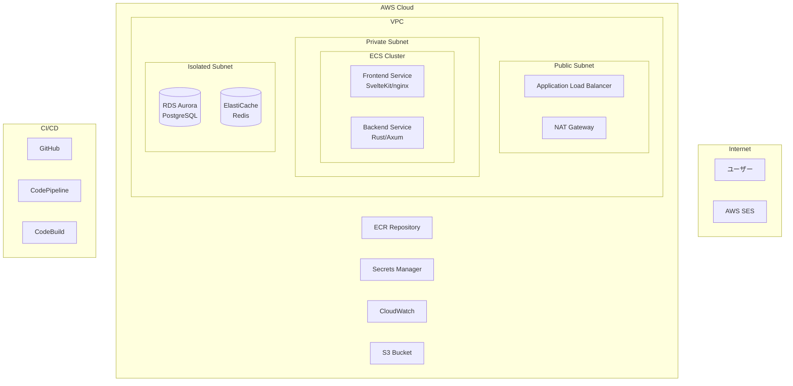

# MarkMail Infrastructure (AWS CDK v2)

このディレクトリには、MarkMailのAWSインフラストラクチャをCDK v2で管理するコードが含まれています。

## 🎯 概要

AWS CDK v2を使用して、本番環境対応の完全なインフラストラクチャを構築・管理します。

## 🏗️ アーキテクチャ



## 📦 作成されるリソース

### ネットワーク層

- **VPC**: 3つのサブネット層（Public、Private、Isolated）
- **セキュリティグループ**: ALB、ECS、RDS、ElastiCache用
- **NAT Gateway**: 高可用性構成（本番環境では2つ）

### コンテナ基盤

- **ECS Cluster**: Fargate起動タイプ
- **ECR Repository**: フロントエンド/バックエンド用
- **Task Definition**: CPU/メモリ設定済み
- **Auto Scaling**: ターゲット追跡スケーリング

### データベース層

- **RDS Aurora PostgreSQL Serverless v2**
  - 自動スケーリング（0.5〜1 ACU）
  - 自動バックアップ（7日間保持）
  - 暗号化有効
- **ElastiCache Redis**: セッション/キャッシュ用

### アプリケーション層

- **Application Load Balancer**: HTTPS対応
- **Target Groups**: パスベースルーティング
- **Health Checks**: カスタマイズ済み

### 監視・ロギング

- **CloudWatch Logs**: コンテナログ
- **Container Insights**: パフォーマンスメトリクス
- **SNS Topics**: アラート通知

### CI/CD

- **CodePipeline**: GitHub連携
- **CodeBuild**: Docker イメージビルド
- **自動デプロイ**: Blue/Greenデプロイメント

### セキュリティ

- **Secrets Manager**: データベース認証情報
- **IAM Roles**: 最小権限の原則
- **KMS**: 暗号化キー管理

## 📋 前提条件

1. **AWS CLI** v2 がインストールされ、認証情報が設定されていること

   ```bash
   aws configure
   ```

2. **Node.js** (v18以上) と **npm** がインストールされていること

3. **AWS CDK v2** がインストールされていること

   ```bash
   npm install -g aws-cdk@latest
   ```

4. **Docker** がインストールされていること（ローカルビルド用）

## 🚀 デプロイ手順

### 1. 依存関係のインストール

```bash
cd infrastructure
npm install
```

### 2. 環境変数の設定

```bash
# 必須設定
export ENVIRONMENT_NAME=dev  # または prod
export NOTIFICATION_EMAIL=admin@example.com
export GITHUB_OWNER=your-github-username
export GITHUB_REPO=markmail
export GITHUB_BRANCH=main

# オプション（デフォルト値あり）
export AWS_ACCOUNT_ID=123456789012
export AWS_REGION=ap-northeast-1
```

### 3. CDKのブートストラップ（初回のみ）

```bash
npm run cdk bootstrap
```

### 4. スタックのデプロイ

```bash
# 全スタックを順番にデプロイ
./deploy-sequential.sh

# または個別にデプロイ
npm run deploy:network
npm run deploy:database
npm run deploy:cluster
# ... など
```

### 5. デプロイ後の設定

1. **GitHub Personal Access Token の設定**

   ```bash
   # AWS Secrets Manager に保存
   aws secretsmanager create-secret \
     --name /markmail/github/token \
     --secret-string "your-github-personal-access-token"
   ```

2. **ドメイン設定**（本番環境の場合）

   - Route 53 でドメインを設定
   - ACM で SSL 証明書を取得
   - ALB にドメインを関連付け

3. **SES 設定**
   - ドメイン検証
   - DKIM 設定
   - SPF レコード追加

## 🧪 テスト

インフラストラクチャのテストを実行：

```bash
npm test
```

現在のテストカバレッジ: **76/76 テスト成功** ✅

## 📊 コスト見積もり

### 開発環境（月額）

- ECS Fargate: ~$30
- RDS Aurora Serverless v2: ~$50
- ALB: ~$20
- その他: ~$10
- **合計: 約$110/月**

### 本番環境（月額）

- ECS Fargate (HA構成): ~$120
- RDS Aurora Serverless v2: ~$100
- ALB: ~$20
- ElastiCache: ~$30
- その他: ~$30
- **合計: 約$300/月**

## 🔧 カスタマイズ

### スケーリング設定の変更

`lib/stacks/ecs-service-stack.ts`:

```typescript
const scalingPolicy = service.autoScaleTaskCount({
  minCapacity: 2,
  maxCapacity: 10,
});
```

### データベースサイズの変更

`lib/stacks/database-stack.ts`:

```typescript
minCapacity: rds.AuroraCapacityUnit.ACU_1,
maxCapacity: rds.AuroraCapacityUnit.ACU_4,
```

## 🗑️ リソースの削除

```bash
# 全リソースを削除
./destroy-stack.sh

# または個別に削除（逆順で実行）
npm run destroy:app
npm run destroy:service
# ... など
```

⚠️ **注意**:

- S3バケットとRDSスナップショットは手動削除が必要です
- 本番環境では削除保護が有効になっています

## 📝 コマンド一覧

```bash
# ビルド
npm run build

# テスト
npm test
npm run test:watch

# CDK操作
npm run synth          # CloudFormationテンプレート生成
npm run diff           # 差分確認
npm run deploy         # 全スタックデプロイ
npm run destroy        # 全スタック削除

# 個別スタック操作
npm run deploy:network
npm run deploy:ecr
npm run deploy:database
npm run deploy:cluster
npm run deploy:alb
npm run deploy:service
npm run deploy:monitoring
npm run deploy:cicd
```

## 🔍 トラブルシューティング

### デプロイが失敗する場合

1. **IAM権限の確認**

   ```bash
   aws sts get-caller-identity
   ```

2. **Docker daemon の確認**

   ```bash
   docker info
   ```

3. **スタック状態の確認**
   ```bash
   aws cloudformation describe-stacks --stack-name MarkMail-dev-*
   ```

### ログの確認

```bash
# ECSタスクログ
aws logs tail /ecs/markmail-backend --follow

# CodeBuildログ
aws logs tail /aws/codebuild/markmail-build --follow
```

### 一般的なエラーと対処法

| エラー                                | 原因               | 対処法                       |
| ------------------------------------- | ------------------ | ---------------------------- |
| `Stack is in ROLLBACK_COMPLETE state` | 前回のデプロイ失敗 | スタックを削除して再作成     |
| `Resource limit exceeded`             | リソース制限       | Service Quotasで上限緩和申請 |
| `Access Denied`                       | IAM権限不足        | 必要な権限を追加             |

## 📚 参考資料

- [AWS CDK v2 Documentation](https://docs.aws.amazon.com/cdk/v2/guide/)
- [ECS Best Practices Guide](https://docs.aws.amazon.com/AmazonECS/latest/bestpracticesguide/)
- [Aurora Serverless v2 Guide](https://docs.aws.amazon.com/AmazonRDS/latest/AuroraUserGuide/aurora-serverless-v2.html)

## 🤝 貢献

インフラストラクチャの改善提案は歓迎します！
[Issues](https://github.com/engineers-hub-ltd-in-house-project/markmail/issues) から提案してください。
